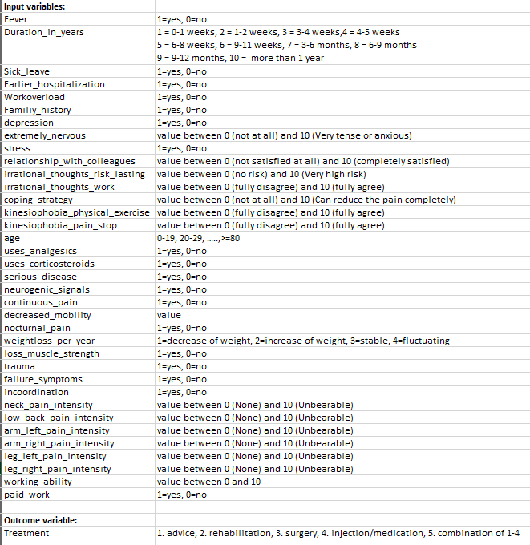

# Referral-Advice-for-patients

Low back pain (LBP) is the most common cause for activity limitation and has a tremendous socioeconomicimpact in Western society. When people get low back pain (LBP), it is not always evident what the correctreferral advice is. A direct correct referral is essential for effective treatment to prevent the development ofchronic LBP the utmost. For a data driven approach to getting more insight in the process of referral advicereferral advice was stored in a database provided by the Groningen Spine Center (GSC) containing patientreported answers to questionnaires and the advised treatment.

Feature names and descriptions:

